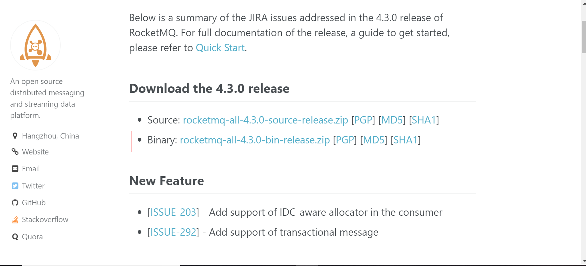

## Windows下安装RocketMQ

安装步骤

<https://blog.csdn.net/javahighness/article/details/79449054> 

解决方案：

<https://blog.csdn.net/jiangyu1013/article/details/81478754>

## 一、下载安装包

下载指定RocketMQ的安装包

下载地址(地址为4.3.0版本)：<http://rocketmq.apache.org/release_notes/release-notes-4.3.0/>

点击下方红框地址下载：



## 二、修改RocketMQ配置

1. 修改内存配置(此步骤可跳过)

   需要执行的命令在程序目录下的bin文件夹下，主要是`mqnamesrv.cmd`和`mqbroker.cmd`这两个命令，但他们调用了各自的`runserver.cmd`和`runbroker.cmd`命令，分别修改这两个文件里的JAVA_OPT设置

   ~~~
   set "JAVA_OPT=%JAVA_OPT% -server -Xms2g -Xmx2g -Xmn1g -XX:MetaspaceSize=128m -XX:MaxMetaspaceSize=320m"
   ~~~

   将Xms Xmx修小一些，改成1g，

   ~~~
   set "JAVA_OPT=%JAVA_OPT% -server -Xms1g -Xmx1g -Xmn1g -XX:MetaspaceSize=128m -XX:MaxMetaspaceSize=320m"
   ~~~

2. 添加Path环境变量

   在启动的时候需要在环境变量中新建一个ROCKETMQ_HOME的填写上对于的rocketmq的安装路径，保存。

## 三、启动NameServer

在rocketmq安装目录下的bin目录下，执行命令：

```
mqnamesrv -n localhost:98761
```

出现`The Name Server boot success.`字样表示成功

## 四、启动Broker

在rocketmq安装目录下的bin目录下，执行命令：

```
mqbroker.cmd -n localhost:98761
```

## 五、搭建RocketMQ web后台控制端

1. 访问 <https://github.com/apache/rocketmq-externals/>使用git把项目clone下来。

2. 修改该SpringBoot下rocketmq-externals\rocketmq-console\src\main\resources 目录下application.properties 文件

   ~~~
   rocketmq.config.namesrvAddr=localhost:9876
   ~~~

3. 启动项目

   在rocketmq-externals\rocketmq-console下执行

   ~~~
   mvn spring-boot:run
   ~~~

   等待启动完成，第一次启动需要等上一段时间。启动完成后输入

   <http://localhost:8080>进入到控制台页面。

[官方文档]: http://rocketmq.apache.org/docs/quick-start/	"RocketMQ"